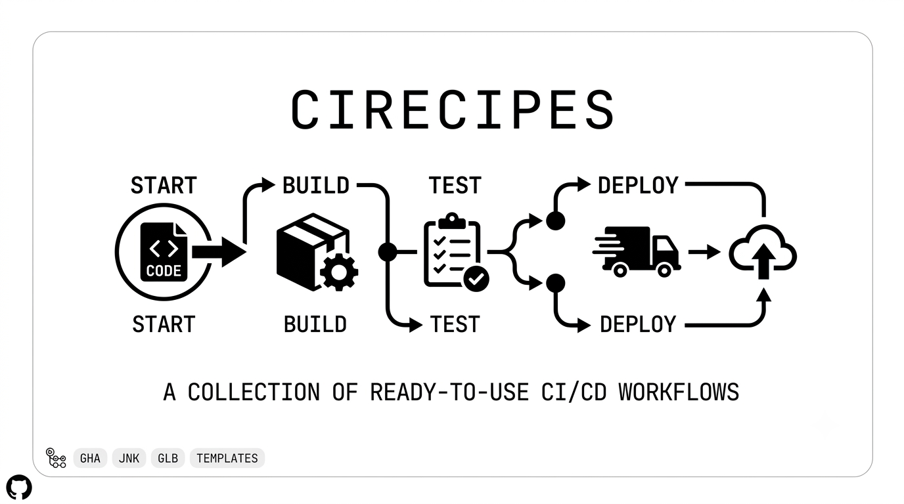

<!-- Favicon del repositorio: docs/img/favicon0.png (GitHub no renderiza <link> en README; se usa en renderizadores externos y GitHub Pages) -->
<link rel="icon" type="image/png" href="docs/img/favicon0.png">

<p align="center">
  
</p>

# cirecipes

<p align="center">
  <a href="https://github.com/iCruzDaniel/cirecipes/actions/workflows/lint.yml"></a>
  <a href="https://github.com/features/actions"></a>
  
  
  
  
</p>

Biblioteca de **flujos CI/CD listos para copiar y pegar**. Cada pipeline está
clasificado por caso de uso y tipo de arquitectura, documentado con su ficha
técnica (`manifest.yml`) y versionado por flujo.

## Cómo navegar

Jerarquía plana: la plataforma está en la carpeta raíz y el resto de la
clasificación en el código. Cada flujo vive en
`PLATAFORMA/CODIGO-TAXONOMICO/vN/`:

```text
github-actions/
├── GHA-DEPLOY-DOCK-REG/   # CD Docker → GHCR (deploy vía Dokploy)
└── GHA-FULL-DOCK-VM/      # CI/CD Docker → VPS por SSH + docker compose
```

El **código taxonómico** de cada carpeta sigue la convención
`[PLATAFORMA]-[TIPO]-[STACK]-[ARQUITECTURA/DESTINO]`. La especificación
completa está en [docs/SDD.md](docs/SDD.md) y la descripción de cada flujo con
sus casos de uso en [docs/flows.md](docs/flows.md).

## Pipelines disponibles

| Código | Plataforma | Tipo | Stack | Destino | Qué hace |
| --- | --- | --- | --- | --- | --- |
| [GHA-DEPLOY-DOCK-REG](github-actions/GHA-DEPLOY-DOCK-REG/v1/README.md) | GitHub Actions | DEPLOY | Docker | Registry (GHCR) | Build + push a GHCR; Dokploy despliega |
| [GHA-FULL-DOCK-VM](github-actions/GHA-FULL-DOCK-VM/v1/README.md) | GitHub Actions | FULL | Docker | VM (SSH) | Build + push a Docker Hub + deploy por SSH con docker compose |

## Cómo reutilizar un flujo

1. **Busca por necesidad:** entra a la carpeta de tu plataforma.
2. **Identifica la arquitectura:** ubica la carpeta con el código taxonómico.
3. **Revisa requisitos:** abre el `manifest.yml` para ver qué `SECRETS`
   configurar en el repositorio destino.
4. **Copia y pega:** lleva el contenido del directorio `v1/` a tu proyecto
   objetivo.

## Validación interna

La biblioteca se valida a sí misma con [`.github/workflows/lint.yml`](.github/workflows/lint.yml),
que ejecuta `scripts/validate_flows.py`: revisa la sintaxis YAML de todos los
flujos y comprueba que cada carpeta de versión contenga su `manifest.yml`.

## Referencias

- [Especificación de diseño (SDD)](docs/SDD.md) — taxonomía, estructura de
  directorios, regla de versionado, schema del `manifest.yml` y validación.
- [Catálogo de flujos](docs/flows.md) — descripción breve y casos de uso de
  cada pipeline.
- Recursos visuales en `docs/img/`: portada (`portada0.png`), logo (`logo.svg`)
  y favicon (`favicon0.png` / `favicon.ico`).
